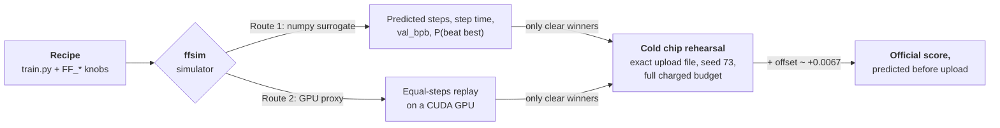
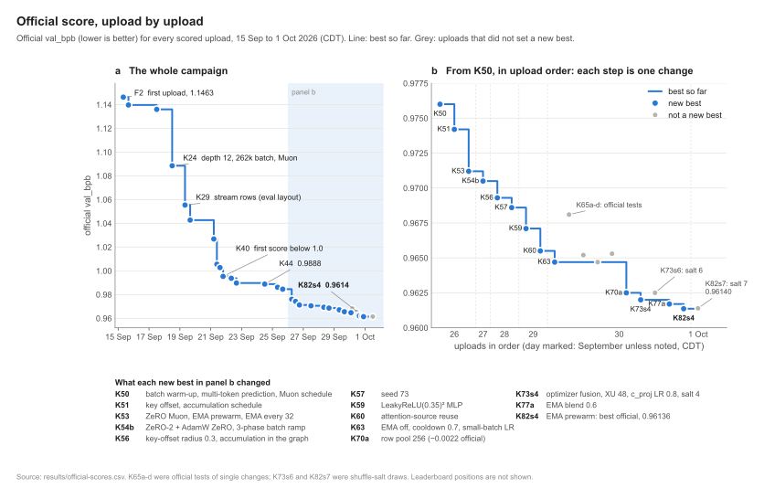
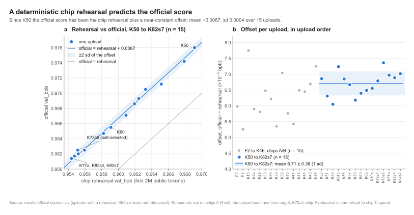
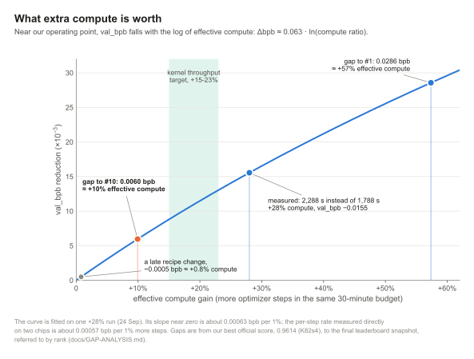
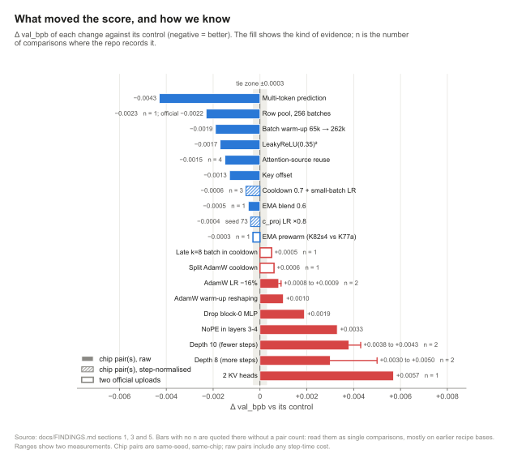

<div align="center">

# FrontierForge

### Know what your Trainium run will score before you spend the chip-hour.

A simulator, a calibration method and a best recipe from Phase 1 of the AWS Trainium Frontier challenge.

[](LICENSE)
[](requirements.txt)
[](tests/)
[](https://github.com/aws-neuron/trainium-frontier)
[](space/)

[Quick start](#quick-start) &middot; [Results](#results) &middot; [Use it on your own runs](#use-it-on-your-own-runs) &middot; [Findings](#key-findings-tldr) &middot; [Limitations](#honest-limitations) &middot; [Cite](#cite-this-work)

</div>

| **0.9888 &rarr; 0.9614** | **1,206** | **+0.0067 &plusmn; 0.0004** | **0.00057 bpb** |
|:---:|:---:|:---:|:---:|
| official val_bpb, 24 Sep &rarr; 30 Sep (CDT) | Trainium run records the simulator is fitted on | rehearsal-to-official offset (mean &plusmn; sd, 15 uploads) | measured price of 1% of training steps |


> This is independent work. It is not affiliated with, sponsored by or endorsed by Amazon Web Services or the AWS Trainium Frontier organisers.

## Why you might care

- **Chip time is the bottleneck.** `ffsim` predicts a recipe's steps, step time and val_bpb in seconds on a laptop
  (numpy only), and tells you when a knob change is inside the noise so you can skip the run.
- **Official scores you can call in advance.** A cold rehearsal of the exact upload file plus an offset that was
  stable within the checks we ran (+0.0067, sd 0.0004, over the 15 rehearsed uploads since K50) predicts the official
  score: an offset frozen before the last day predicted the final seven uploads with a mean absolute error of 0.00035,
  almost all of it a positive bias. You can test on your own chip instead of on the leaderboard.
- **Speed has an exchange rate.** `delta_bpb ~= 0.063 * ln(compute ratio)` turns any throughput gain into score,
  so you can price a kernel before you write it.

## How it works



```
official_bpb = quality(recipe, steps, seed) + offset(eval shard)
steps        = the batch-schedule walk over the charged-time budget at the recipe's step time
```

Speed and quality are modelled separately because the challenge scores a fixed wall-clock budget.

| | Route 1: the surrogate | Route 2: the GPU proxy |
|---|---|---|
| **What** | step-time model per code lineage, a replay of `train.py`'s charged-clock schedule, a ridge-regression quality model and a rehearsal-to-official offset model, run as a Monte Carlo with common random numbers | a generated CUDA fork of the real `train.py` driven by a *virtual charged clock*, so every batch-phase, MTP-stage and cooldown switch fires at the same step as on the chip |
| **Needs** | Python 3.11 + numpy | an NVIDIA GPU, CUDA PyTorch, the organiser's `prepare.py` and tokenizer |
| **Fitted / checked on** | 1,206 run records (928 full runs, 278 screens); quality model on 131 full runs; 99 same-seed pairs, each left out in turn | Trainium pairs the campaign had already paid for |
| **How close** | K60 predicted 2,365 &plusmn; 9 steps and 0.9654 official, measured 2,361 and 0.9655; 82.8% sign agreement on the 87 recipe-change pairs (a development-set estimate: the surrogate's configuration was chosen with these results in view) | one K60 run matched the chip to 4e-6 at equal steps (partly luck: default CUDA runs differ by 0.00056 between boxes); four paired effects within about 0.0002 |

Full details, calibration tables and caveats: [`docs/SIMULATOR.md`](docs/SIMULATOR.md). The rehearsal method:
[`docs/EXACT-ORACLE.md`](docs/EXACT-ORACLE.md).

## Results

<p align="center">
  
</p>

| upload | date (CDT) | official val_bpb | what it added |
|---|---|---:|---|
| F2 | 15 Sep | 1.1463 | first upload |
| K40 | 21 Sep | 0.9953 | depth 10 x width 1024, Muon shard; first score under 1.0 |
| K44 | 24 Sep | 0.9888 | cooldown 0.60 |
| K50 | 26 Sep | 0.9760 | multi-token prediction, batch warm-up |
| K60 | 29 Sep | 0.9655 | attention-source reuse |
| K70a | 30 Sep | 0.9625 | row-pool data sampling |
| K73s4 | 30 Sep | 0.9620 | optimizer fusion + XU 48 + c_proj LR 0.8, shuffle salt 4 |
| K77a | 30 Sep | 0.9617 | + EMA blend 0.6 |
| K82s4 | 30 Sep | **0.96136** | + EMA prewarm (**best scored**); rehearsal 0.954472, projected 0.9614-0.9615 |
| K82s7 | 1 Oct | 0.96140 | K82s4 with shuffle salt 7; best rehearsal of the campaign (0.954379), projected about 0.9614 |

Every scored upload, with its rehearsal and offset, is in [`results/official-scores.csv`](results/official-scores.csv);
the story behind them is in [`docs/FINDINGS.md`](docs/FINDINGS.md). In the final leaderboard snapshot (about 7:40 AM
CDT on 1 Oct) rank #10 was 0.9554 and rank #1 was 0.9328, so we finished outside the top 10, 0.0060 behind #10.

<table>
  <tr>
    <td width="50%"></td>
    <td width="50%"></td>
  </tr>
  <tr>
    <td><b>Exact oracle.</b> Over the 15 rehearsed uploads since K50 the offset averaged +0.0067 (sd 0.0004, range +0.0061 to +0.0074). The largest miss against a written projection was 0.0006 (K73s6, a salt-selected draw); both final uploads landed within 0.0001.</td>
    <td><b>Exchange rate.</b> <code>delta_bpb ~= 0.063 * ln(compute ratio)</code>, fitted on one run given +28% compute, which bought -0.0155. The per-step rate measured directly on two chips is about 0.00057 bpb per 1% more steps.</td>
  </tr>
</table>

## Quick start

```bash
git clone https://github.com/marker2601/trainium-simulator.git
cd trainium-simulator
pip install -r requirements.txt
python -m pytest -q tests/        # 385 pass, 7 skip (5 need the full private chip harvest, 2 need gradio)
```

**Command line.** Fit the three models from the shipped dataset (about 2 s), check them, then predict:

```bash
python -m ffsim fit --runs research/sim-data/runs.jsonl --pairs research/sim-data/validation-pairs.json \
    --uploads research/sim-data/official-uploads.csv --out research/sim-data/models.pkl
python -m ffsim validate

# one recipe (omit --seed to average over seeds)
python -m ffsim simulate --recipe ffsim/examples/recipe-K60.json --n 2000 --seed 73

# every single and double knob change around K60, ranked, with a "confirm next" list
python -m ffsim search --space ffsim/examples/space-k60-local.json --n-sims 1000 --top 20 \
    --out out/search-k60-local
```

**Local app.** A Gradio UI with four tabs: predict a recipe, a speed-to-score calculator, add your own runs, and an
about page.

```bash
pip install -r space/requirements.txt
python space/app.py               # then open http://127.0.0.1:7860
```

**From Python.** Every button is an API endpoint (`/predict`, `/predict_overrides`, `/speed_to_score`,
`/score_to_speed`, `/contrib_record`):

```python
from gradio_client import Client

c = Client("http://127.0.0.1:7860/")
c.predict("K82s4", "FF_COOLDOWN_FRAC=0.6 FF_MATRIX_LR_SCALE=2.3", 73, "C", 2000,
          api_name="/predict_overrides")              # tweak our best recipe
c.predict(0.9614, 10, api_name="/speed_to_score")      # what does +10% throughput buy?
c.predict(0.9614, 0.9554, api_name="/score_to_speed")  # how much speed to reach a target?
```

Argument details are in [`space/README.md`](space/README.md). The GPU proxy has its own setup
([`docs/SIMULATOR.md`](docs/SIMULATOR.md#route-2-the-gpu-proxy)).

## Use it on your own runs

The shipped models know our recipe family. To make them know yours, give `ffsim` your own runs and refit.

1. **Collect run directories.** Lay them out as `<dir>/chipC/<run>/` (chip letters A-D), each holding the
   `train.log`, `eval.log` and `overrides` files your runs write. The three reference runs in
   [`research/sim-data/chipC/`](research/sim-data/chipC/) show the expected shape. `ffsim/harvest.py` can copy
   them off Trainium instances over AWS SSM (read-only; configure it with `FFSIM_AWS_PROFILE` and
   `FFSIM_CHIP_C_REGION` / `FFSIM_CHIP_C_INSTANCE`).
2. **Build a dataset.** Each run becomes one `RunRecord` JSON line (schema in [`ffsim/schema.py`](ffsim/schema.py),
   contract in [`ffsim/CONTRACT.md`](ffsim/CONTRACT.md)). You can also write those lines directly from your own logs.

   ```bash
   python -m ffsim build-dataset --chips-dir my-runs --experiments none --monitor none --out out/my-runs.jsonl
   ```

3. **Add pairs and uploads.** Same-seed treatment/control pairs score the quality model, and your rehearsal-vs-official
   table fits the offset. Copy the formats of `research/sim-data/validation-pairs.json` and `official-uploads.csv`.
4. **Fit, validate, predict.** Append your records to the shipped `runs.jsonl` or fit on yours alone:

   ```bash
   python -m ffsim fit --runs out/my-runs.jsonl --pairs my-pairs.json --uploads my-uploads.csv --out out/my-models.pkl
   python -m ffsim validate --models out/my-models.pkl
   python -m ffsim simulate --recipe my-recipe.json --vs ffsim/examples/recipe-K60.json --models out/my-models.pkl
   ```

With only a handful of your own runs the quality model is mostly its priors (on the three reference runs alone its
sd is about 0.005 bpb), so append your records to the shipped `runs.jsonl` unless your recipe family is very different.

A recipe is a JSON file with a code version, a chip, a time target and its `FF_*` knobs (see
[`ffsim/examples/`](ffsim/examples/)). Read results with the decision rule in [`ffsim/README.md`](ffsim/README.md):
confirm on a chip only candidates with `support ok` and a paired gain of 0.0003 or better; everything smaller is a
tie, and anything flagged `EXTRAP`, `NEVER-VARIED` or "cost unknown" needs a speed screen first.

> [!WARNING]
> `models.pkl` is a pickle. Build your own with `fit`; never load one from someone else.

## Help the simulator learn

[](contrib/stats.json)

<!-- contrib-stats:start -->Contributed runs so far: **0**. Be the first: the simulator refits on every merged submission (see [CONTRIBUTING.md](CONTRIBUTING.md)).<!-- contrib-stats:end -->

The simulator is only as good as the runs it has seen, and almost all of them are ours. If you trained a recipe on
Trainium (or replayed one on the GPU proxy), share the numbers you already have: score, steps, seed and the `FF_*`
knobs you changed. Every merged run is added to the data and the models are refitted on it, with a guard that
refuses any refit that makes the model worse on our own runs. A run the model gets wrong is the most useful one you
can send.

**Three ways to submit** (all end in the same reviewed pull request):

1. **The app.** The "Add my runs" tab (`python space/app.py`) checks your run and builds a pre-filled GitHub issue
   link. Nothing is sent until you open the link and submit the issue yourself.
2. **The issue form.** [Open a "Submit a training run" issue](https://github.com/marker2601/trainium-simulator/issues/new?template=run-submission.yml)
   and paste one JSON record (format: [`contrib/schema.json`](contrib/schema.json)).
3. **The command line.** Check a record locally, then print its issue link:

   ```bash
   python -m ffsim contrib validate my-run.json     # schema, secret scan, duplicate check, outlier guard
   python -m ffsim contrib issue-url my-run.json    # pre-filled issue URL
   ```

A record, starting from our published K82s4 recipe and listing only what you changed:

```json
{"schema_version": "1", "hardware": "trn2.3xlarge", "time_budget_s": 1800, "base_recipe": "K82s4",
 "recipe": {"FF_COOLDOWN_FRAC": "0.65"}, "seed": 58, "chip_val_bpb": 0.9551, "steps": 2390,
 "contributor": "your-github-login", "consent": true}
```

**What happens next:** the issue is public as soon as you submit it. A GitHub Action re-validates the record and
comments the result; a maintainer reviews it and approves it with the `contrib-approved` label, which opens a pull
request labelled `contrib` (an edit after approval withdraws the approval); merging it triggers a guarded refit that
opens a pull request updating the fitted model ([`ffsim/model/params.json`](ffsim/model/params.json), plain JSON,
never a pickle) and the statistics above, including the error on contributed runs before and after the model learned
from them (leave-one-out). **Only what is in the JSON goes into the data**, and anything that looks like an account
id, instance id, key, token, e-mail or IP address, in the record or the issue text, is rejected. Full details:
[CONTRIBUTING.md](CONTRIBUTING.md).

## Key findings (TL;DR)

- **Row-pool data sampling was the best late lever: -0.0023 on chip, -0.0022 officially** (0.9647 &rarr; 0.9625).
  It shuffles rows within a 256-batch pool, starting after the warm-up. Nearly free: 11 fewer steps (-0.5%) on its
  chip pair.
- **EMA blend 0.6:** about -0.0005 on one chip pair; officially K77a 0.9617 vs K73s4 0.9620.
- **EMA prewarm** moves the EMA kernel compile out of the charged clock. On chip G the EMA recipe ran 2,375 steps
  without it and 2,405 with it; officially K82s4 0.96136 vs K77a 0.9617, about -0.0003 (one pair).
- **Steps were the main currency.** A 30-minute run did 912 steps on 18 Sep and about 2,390 on 30 Sep at the same
  batch size, almost all of it from compiler-friendly code.
- **Seeds are a lottery with a known shape.** About 40% of seeds take a warm-up "spike" path in steps 3-10 that
  costs +0.003 to +0.0045 for good. Any change to steps 0-19 re-rolls it.
- **What lost:** bigger models (depth 10 about +0.004, 2 KV heads +0.0057), a smaller faster one (depth 8 +0.005),
  a late k=8 batch, split AdamW cooldown, AdamW LR retunes, NoPE, dropping MLPs. Scalar retunes won 0 of 61 knob keys.
- **The gap to the top 10 was throughput, not recipe.** From 0.9614, rank #10 in the final snapshot (0.9554) needed
  about +10% effective compute and rank #1 (0.9328) about +57%. We ran about 285k tokens/s, roughly 30% MFU.

<p align="center">
  
</p>

More in [`docs/FINDINGS.md`](docs/FINDINGS.md) and [`docs/GAP-ANALYSIS.md`](docs/GAP-ANALYSIS.md).

<details>
<summary><b>Reproducing the recipe on Trainium</b></summary>

1. Set up the organiser's kit ([github.com/aws-neuron/trainium-frontier](https://github.com/aws-neuron/trainium-frontier))
   on a trn2 instance as its README describes.
2. Replace its `train.py` with [`recipes/K82s4/train.py`](recipes/K82s4/train.py). Every setting is a default in the
   file: run it with no environment overrides, seed 73.
3. Run the kit's training and public-shard evaluation. A cold run on our chips gave val_bpb 0.954472 at 2,388 steps
   on the first 2M public tokens. Add about +0.0066 to +0.0070 for the private-shard score; the official score of
   this file was 0.96136.

`recipes/K60/train.py` is the 29 Sep recipe (official 0.9655); the GPU proxy is generated from it. Lineage and
checksums are in [`recipes/README.md`](recipes/README.md).

</details>

## Repository layout

```
ffsim/                 the simulator: route 1 (numpy surrogate), gpu/ (route 2 proxy), cloud/, examples/
space/                 the Gradio app (python space/app.py) and its API
contrib/               schema.json (one contributed run) and stats.json (what the community has added)
.github/               run-submission issue form; CI, contribution-check and refit workflows
recipes/               K82s4 and K60 train.py, byte-identical to the uploaded files (Apache-2.0)
docs/                  FINDINGS, SIMULATOR, EXACT-ORACLE, GAP-ANALYSIS, campaign-time notes
docs/figures/          every figure (SVG, PNG, PDF) and the one script that builds them from repo data
paper/                 OUTLINE.md: the plan, claims ledger and open experiments for the technical report
results/               official-scores.csv: every scored upload with rehearsal and offset
research/sim-data/     runs.jsonl, validation-pairs.json, official-uploads.csv, validation reports, searches,
                       contrib/runs-contrib.jsonl (merged community runs)
research/              experiments.csv (chips A/B table) and the K60 cold rehearsal log
tests/                 392 tests (385 pass, 7 skip: 5 need the private chip harvest, 2 need gradio) and fixture logs
```

## Honest limitations

- **New mechanisms are outside what the surrogate can know.** On 15 pairs that finished after the fit it scored 53%
  sign agreement and an MAE of 0.00104: a noise-floor detector, not an oracle. Every late win (row pool, EMA blend,
  prewarm) was a mechanism it had never seen.
- **Differences under about 0.0003 are a coin flip.** Read them as ties and confirm winners on a real chip.
- **Model size is not modelled.** Depth, width, head dim, KV heads and MLP width never varied in the fitted runs, so
  changing them gets a flat +3% "cost unknown" step-time charge and an unfitted quality prior.
- **Two calibration targets are missed, on purpose and in the open.** Step time is 0.545% off against a 0.5% target,
  and the pair MAE (0.00039) sits at the noise floor above its 0.0003 target, so `ffsim validate` prints
  `passes: False`.
- **It is calibrated to one setting:** single-chip trn2 runs of one nanoGPT-style recipe family and this challenge's
  evaluation shards. The offset is mostly a property of the evaluation text and may also depend on the instance that
  ran the rehearsal; it is not a universal constant.
- **Selected draws partly regress.** K82s7 had the best rehearsal of the campaign (0.954379) but scored 0.96140,
  just behind K82s4 (0.96136); K73s6 gave back its whole local edge. Pick by rehearsal, but expect less.

## Cite this work

If `ffsim`, the exact-oracle method or the findings help your work, please cite the software
([`CITATION.cff`](CITATION.cff); GitHub's "Cite this repository" button reads it). A paper describing the method is
in preparation; its outline and claims ledger are in [`paper/OUTLINE.md`](paper/OUTLINE.md).

```bibtex
@software{frontierforge_2026,
  author  = {Gorla, Jagadeesh Kumar},
  title   = {FrontierForge: a Trainium run simulator and exact-oracle score prediction},
  year    = {2026},
  version = {1.0.0},
  url     = {https://github.com/marker2601/trainium-simulator},
  license = {MIT}
}
```

## Acknowledgements

Thanks to the **AWS Trainium Frontier organisers** for the challenge, the hardware, the baseline and a leaderboard
that kept us honest. Our recipes stand on the open-source **nanoGPT** and **modded-nanogpt** speedrun communities
and the **Muon** optimizer community, whose public work made a 30-minute language model worth racing.

## Star request

If `ffsim` saved you a chip-hour, a star helps other Trainium teams find it.

## Licence

Our code, data and documents are under the [MIT licence](LICENSE). `recipes/*/train.py` and `ffsim/gpu/train_gpu.py`
are modified versions of the organiser's Apache-2.0 baseline and stay under
[Apache-2.0](recipes/LICENSE-APACHE-2.0); see [`NOTICE`](NOTICE). The organiser's kit, tokenizer and data are not
redistributed here.
