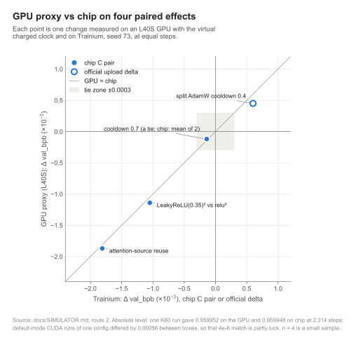

# Paper outline: a short technical report on the FrontierForge Phase 1 campaign

> **Status.** Planning draft, written 1 Oct 2026 (CDT). Target: a 6-8 page arXiv technical report (cs.LG) and,
> if the extra experiments land, a 4-page workshop version.
>
> **Ground rules.**
> - Every number below links to the repo file that backs it.
> - A number tagged **[pending]** is not yet measured or scored.
> - A reference tagged **[TO-VERIFY]** is a pointer to look up, not a citation.
> - Other teams are referred to by leaderboard rank only, never by name.
> - Times are US Central (CDT).
>
> The draft figures live in [`docs/figures/`](../docs/figures/), shared with the README. One script,
> [`docs/figures/make_figures.py`](../docs/figures/make_figures.py), builds each one from repo files as SVG, PNG and
> PDF (for LaTeX) in a single style.

---

## At a glance

| | |
|---|---|
| **Setting** | AWS Trainium Frontier, Phase 1: train a language model from scratch in a 30-minute charged-time budget on trn2. Score = val_bpb on a hidden shard (lower is better). The submission is a single `train.py` under 262,144 bytes. |
| **Campaign** | 15 Sep to 1 Oct 2026 (CDT), 30 scored uploads with a chip rehearsal, about 1,200 harvested chip-run records. |
| **Result** | Official val_bpb **1.1463 → 0.96136** (K82s4, best scored). From 24 Sep alone: 0.9888 (K44) → 0.9614. Both final uploads (K82s4 0.96136, K82s7 0.96140) landed within 0.0001 of their projections. |
| **The one-line lesson** | In a fixed wall-clock contest, **steps are the currency**: Δbpb ≈ 0.063 · ln(compute ratio), and the per-step rate we measured is about 0.00057 bpb per 1% more steps. Every other change has to be priced in that currency. |
| **Artifacts** | `ffsim` (simulator), a local Gradio app with 4 API endpoints, two recipes (K60, K82s4), the run dataset, the scores ledger and 384 passing tests (5 skipped). |

  

---

## 1. Title options

1. **Rehearse, Don't Guess: Exact-Oracle Evaluation and a Calibrated Run Simulator for a 30-Minute Trainium Speed-Run**
2. **Steps Are the Currency: Pricing Every Change in a Wall-Clock-Bounded Language-Model Speed-Run on AWS Trainium**
3. **Thirty Minutes on Trainium: Deterministic Rehearsal, Simulation and Data Decorrelation in a Training Speed-Run**

Option 1 leads with the methodological contribution and travels best beyond this one competition. Option 2 is
the most memorable. Option 3 is the safest workshop title.

---

## 2. Abstract (draft, 198 words)

> Wall-clock-bounded training competitions reward whatever turns a fixed time budget into the lowest validation
> loss, yet full trials are expensive and leaderboard feedback is scarce. We report a 17-day campaign in a
> 30-minute language-model speed-run on AWS Trainium, in which the official validation bits-per-byte fell from
> 1.1463 to 0.9614. We make three contributions.
>
> First, an *exact-oracle* protocol. Training on the accelerator is deterministic for a given file and seed, so a
> cold, full-length rehearsal of the exact submission predicts the hidden-shard score up to a near-constant
> offset: +0.0067, sd 0.0004, over 15 submissions.
>
> Second, *ffsim*, a run simulator that models step time and per-step quality separately. It pairs a numpy
> surrogate fitted on about 1,200 chip-run records with a GPU proxy that replays the chip's
> schedule; on four paired effects the proxy agreed with the chip to within about 0.0002 bpb.
>
> Third, an accounting of what mattered:
> - a log-compute exchange rate that prices every change;
> - a 256-batch row pool, worth −0.0022 officially for about 0.5% of steps;
> - a trap that charges one-time kernel compilation to the training clock;
> - negative results placing the remaining top-10 gap at about +10% effective compute.
>
> We release the code, data and recipes.

*Word count check before submission: 150-200 words. The final scores (E0) are in; recount after any edit.*

---

## 3. Contributions

| # | Contribution | Headline evidence | Backing |
|---|---|---|---|
| C1 | **Exact-oracle evaluation on a deterministic accelerator.** A cold rehearsal of the exact upload file plus a text-dependent offset predicts the official score. | Offset +0.0067 (sd 0.0004, range +0.0061 to +0.0074) over the 15 uploads since K50. The largest miss against a written projection was 0.0006 (K73s6, salt-selected); both final uploads landed within 0.0001. Cold and warm runs of one file agreed to 5e-6. | [`docs/EXACT-ORACLE.md`](../docs/EXACT-ORACLE.md), [`results/official-scores.csv`](../results/official-scores.csv), Fig. 3 |
| C2 | **A calibrated run simulator (surrogate + GPU proxy).** It splits score into step time × step walk × per-step quality + offset. | Surrogate: 84.8% sign agreement and MAE 0.00039 on all 99 leave-one-pair-out pairs (Fig. 7); K60 anchor predicted inside 1 sd. GPU proxy: one K60 run matched the chip to 4e-6 at equal steps, which is partly luck (default CUDA runs of one config differ by 0.00056 between boxes); four paired effects agreed within about 0.0002 (Fig. 6). | [`docs/SIMULATOR.md`](../docs/SIMULATOR.md), [`research/sim-data/quality-validation.md`](../research/sim-data/quality-validation.md) |
| C3 | **An accounting of what moved the score**, in three parts: | | |
| C3a | **Data-sampling decorrelation (row pool).** Rows are shuffled across a 256-micro-batch pool after the warm-up. Its step cost is small, not zero. | −0.0023 on chip: chip E 0.957259 at 2,318 steps vs 0.959523 at 2,329 (−0.5% steps; about −0.0026 step-normalised). −0.0022 officially (K70a 0.9625 vs K63 0.9647). A pool of 1,024 matched 256; a pool of 64 helped less. | [`docs/FINDINGS.md`](../docs/FINDINGS.md) §3, `recipes/K82s4/train.py` (`FF_ROW_SHUFFLE`) |
| C3b | **The EMA-prewarm accounting trap.** A one-time kernel compile that lands inside charged time quietly costs steps. Warm rehearsals hide it. | Same chip G: 2,398 steps without EMA (K73s6), 2,375 with EMA (K77a), 2,405 with EMA and prewarm (K82s7; a different salt, which does not change step time). Chip H: 2,390 without EMA vs 2,388 with both. Officially K82s4 0.96136 vs K77a 0.9617: about −0.0003, one pair. The EMA blend itself (about −0.0005, one chip pair without prewarm) is a separate effect. | [`docs/EXACT-ORACLE.md`](../docs/EXACT-ORACLE.md) "The traps", [`docs/FINDINGS.md`](../docs/FINDINGS.md) §3, Fig. 2 |
| C3c | **Negative results and a throughput gap analysis.** Bigger and smaller models both lost, and 61 scalar knobs won nothing. The exchange rate turns the gap into compute. | From 0.96136, gap to #10 (0.9554, final snapshot): 0.0060, about +10% effective compute. Gap to #1 (0.9328): 0.0286, about +57%. We ran at about 285k tokens/s, roughly 30% MFU, with about 19% of the time idle on host dispatch. | [`docs/GAP-ANALYSIS.md`](../docs/GAP-ANALYSIS.md), [`docs/FINDINGS.md`](../docs/FINDINGS.md) §5-6, Figs. 4-5 |

<table>
<tr>
<td width="50%"></td>
<td width="50%"></td>
</tr>
<tr>
<td></td>
<td></td>
</tr>
</table>

---

## 4. Section-by-section plan

Target length: about 7 pages of main text plus an appendix. The page budget is in brackets.

### §1 Introduction [0.75 p]

- **Problem.** In a fixed wall-clock contest, only the score the budget buys counts. Full trials cost chip time,
  and leaderboard feedback is rate-limited.
- **Thesis.** Treat the contest as an accounting problem:
  - price every change in steps (the exchange rate);
  - predict the official score before uploading (the exact oracle);
  - screen ideas without chips (the simulator).
- **Contributions.** The C1-C3 list above.
- **Backing:** Fig. 1, [`results/official-scores.csv`](../results/official-scores.csv).

### §2 Setting and baseline [0.75 p]

- **Challenge rules.**
  - 30-minute charged budget, which excludes startup.
  - Score is val_bpb on a private shard.
  - The submission is one `train.py` under 262,144 bytes.
  - Cite the organiser's public kit; do not redistribute it.
- **Hardware.** trn2. Graph compilation runs through the Neuron compiler, so eager dispatch overhead matters.
- **Final recipe** (§2 of FINDINGS):
  - depth 9 × width 1024, GQA with one KV head;
  - value embeddings, LeakyReLU(0.35)^2, attention-source reuse, key offset, 3-token MTP;
  - Muon + AdamW, a 65k → 131k → 262k batch warm-up, 70% cooldown;
  - about 124M parameters.
- **Table 1:** recipe summary (copy from [`docs/FINDINGS.md`](../docs/FINDINGS.md) §2).
  - Files: [`recipes/K82s4/train.py`](../recipes/K82s4/train.py) (252,013 bytes) and
    [`recipes/README.md`](../recipes/README.md).

### §3 Exact-oracle evaluation (C1) [1 p]

- **Protocol.** A cold, full-budget rehearsal of the exact file at the upload seed, scored on the first 2,097,152
  public tokens. Add the offset.
- **Why it works:**
  1. Determinism: cold vs warm runs of one file gave 1.041525 vs 1.041520.
  2. The offset belongs to the text, not the recipe: the same model scores about +0.0070 worse on 20M public
     tokens than on the first 2M.
- **Calibration table.** The four periods in [`docs/EXACT-ORACLE.md`](../docs/EXACT-ORACLE.md):

  | uploads | mean | sd |
  |---|---|---|
  | 7 chip-C | +0.00654 | 0.00040 |
  | 7 final-day | +0.00687 | 0.00030 |
  | 15 since K50 | +0.00671 | 0.00038 |
  | all 30 | +0.00648 | 0.00061 |

  `docs/figures/make_figures.py` recomputes the "since K50" row from the CSV (Fig. 3).
- **Held-out check (E4c, done).** Freeze the chip-C fit (+0.00653, K51-K60) and predict the seven final-day
  uploads. Error = official_bpb − rehearsal_bpb − 0.00653, from the unrounded columns:

  | upload | chip | error |
  |---|---|---|
  | K63 | C | −0.00004 |
  | K70a | E | +0.00002 (rehearsal speed-normalised to chip C) |
  | K73s4 | H | +0.00026 |
  | K73s6 | G | +0.00083 (salt-selected) |
  | K77a | G | +0.00044 |
  | K82s4 | H | +0.00036 |
  | K82s7 | G | +0.00049 (salt-selected) |

  - n = 7: MAE 0.00035, bias +0.00034. The final-day chips ran a little hotter than chip C.
  - Computed from [`results/official-scores.csv`](../results/official-scores.csv). Report it as prospective
    evidence, with the selection effect on K73s6 and K82s7 called out.
- **Traps:**
  - one-time compiles inside charged time (→ §6);
  - chip speed spread of up to 3.5%, and 7-12% on an older runtime;
  - the warm-up coin flip;
  - the time target is a budget: the step clock stops a median 5.5 s early.
- **Anomalies excluded,** and named: the organiser's K44 rerun and the truncated F6 duplicate
  (`research/sim-data/official-uploads.csv`).
- **Fig. 3** (done). Logs: `research/rehearsal-logs/C41_cold_K60/` (2,361 steps, 0.95910 → 0.9655 official).

### §4 ffsim: a calibrated run simulator (C2) [1.5 p]

- **Decomposition.**
  - `official = quality(recipe, steps, seed) + offset`
  - `steps = walk(schedule, time target − 5.5 s, step time per phase)`
- **Data.** [`research/sim-data/runs.jsonl`](../research/sim-data/runs.jsonl): 1,206 records (928 full runs,
  278 screens) from four chips. Also 99 same-seed pairs (`validation-pairs.json`) and the uploads table. Dataset
  QA: [`research/sim-data/dataset-qa.md`](../research/sim-data/dataset-qa.md).
- **Route 1, the surrogate** (`ffsim/steptime.py`, `simulate.py`, `quality.py`, `offset.py`):
  - **Step time.** Leave-one-lineage-out error is 0.545% run-weighted, which misses the 0.5% target. Report the
    miss.
  - **Step walk.** It reproduces phase switches to within 6-10 steps and the total to within 0.3%.
  - **Quality.** Ridge regression on 131 full chip runs, residual sd 0.0003. Leave-one-pair-out: 84.8% sign
    agreement, MAE 0.00039, on all 99 pairs. Leave-one-knob-value-out on the same 99: 84%, MAE 0.00058 (on the
    73-pair pre-registered list in `quality-validation.md`: 84%, 0.00060).
  - **Monte Carlo with common random numbers,** so paired deltas are real confidence statements.
- **The honest row.** On the 15 pairs that finished after the fit: 53% sign agreement, MAE 0.00104
  ([`docs/simulator-report-20260929.md`](../docs/simulator-report-20260929.md) §5).
  - The surrogate is a *noise-floor detector*, not an oracle, for new mechanisms.
  - Its value was negative screening: none of 282 local candidates cleared the chip-confirmation bar.
- **Route 2, the GPU proxy** (`ffsim/gpu/`):
  - a generated fork (32 checked patches);
  - a *virtual charged clock* that fires every schedule switch at the chip's step number;
  - emulation of the 8-rank data sharding;
  - a calibration-before-use protocol ([`ffsim/gpu/PROTOCOL.md`](../ffsim/gpu/PROTOCOL.md)).
- **Determinism note.** CUDA defaults differed by 0.00056 between boxes. Deterministic algorithms made runs
  identical, at 76k vs 104k tokens/s.
- **Table 2:** calibration (from [`docs/SIMULATOR.md`](../docs/SIMULATOR.md)). **Fig. 6** (done): GPU vs chip
  paired effects; say n = 4 and that one point is an official delta. **Fig. 7** (drafted,
  [`docs/figures/simulator_pairs`](../docs/figures/simulator_pairs.svg)): surrogate predicted vs observed on all
  99 pairs; add the 15 post-fit pairs.

### §5 What moved the score (C3a, C3c) [1.5 p]

- **5.1 Steps.** 912 steps (18 Sep) → about 2,390 (30 Sep) at the same batch size. All of the throughput wins
  removed eager dispatch:

  | change | step time |
  |---|---|
  | scalar stack | −9.1% |
  | fused cross-entropy | −2.8% |
  | Muon sharding | −2.6% |
  | optimizer fusion | about −0.7% |

  Fig. 2 (steps per rehearsal, labelled by chip: chips differ by up to 3.5%, so compare within a chip).
- **5.2 The exchange rate.** Δbpb ≈ 0.063 ln(compute ratio), fitted on a 2,288 s vs 1,788 s run (+28% compute
  bought −0.0155). Keep two rates apart: the fit's slope near a ratio of 1 is about 0.00063 per 1%, and the per-step
  rate measured directly on two chips is about 0.00057 per 1%. Fig. 4 (done).
- **5.3 Structural levers** (§1 and §3 of FINDINGS):

  | lever | effect |
  |---|---|
  | multi-token prediction | −0.0043 |
  | row pool | −0.0023 |
  | batch warm-up | −0.0019 |
  | LeakyReLU(0.35)^2 | −0.0017 |
  | attention-source reuse | −0.0015 |
  | key offset | −0.0013 |

  - Attention-source reuse has four same-seed pairs. Most of the others are single pairs: say so in the text.
- **5.4 The row pool (C3a), in detail:**
  - **Mechanism.** The loader fills rows from parallel token streams, so a micro-batch's rows are contiguous
    stream slices. From micro-batch 96 on, rows are drawn without replacement from a lookahead pool of 256
    micro-batches. This is a shuffle buffer at row granularity. The warm-up (micro-batches 0-95) is unchanged on
    purpose, so the warm-up path is not re-rolled.
  - **Evidence.** One chip pair and one official pair (C3a above). The chip pair lost 11 steps (−0.5%), so the gain
    is not free, only cheap. Pool size: 1,024 ≈ 256 > 64. Other order
    tricks were null (0 ± 0.0003): bigger pools, epoch reshuffles, pool-aware accumulation, document reordering.
  - **Hypothesis to state carefully:** it reduces within-batch correlation and gradient variance. It is *not*
    shown yet: see experiment E3.
- **5.5 Negative results.** Table 3 from FINDINGS §5:
  - depth 10 +0.0038 / +0.0043; 2 KV heads +0.0057; depth 8 +0.0050;
  - late k=8 batch +0.0005 official; split AdamW cooldown +0.0006 official;
  - 0 of 61 scalar knob keys won.
  - Fig. 5 (done): each bar marked chip pair, step-normalised chip pair or official pair, with n where recorded.

### §6 The EMA-prewarm accounting trap (C3b) [0.5 p]

- **The trap.** The first EMA-on run on a fresh chip compiles the EMA kernels inside charged time and loses
  15-30 steps. Warm rehearsals do not pay that cost, so they look 0.0002-0.0006 better than the cold official
  run.
- **The fix.** `FF_EMA_PREWARM` runs one EMA update during the excluded startup steps (`recipes/K82s4/train.py`,
  around the `EMA_PREWARM` flag).
- **Evidence, same chip.** Chip G: 2,398 steps without EMA (K73s6), 2,375 with EMA (K77a), 2,405 with EMA and
  prewarm (K82s7). The salts differ, which changes data order, not step time. Chip H: 2,390 without EMA (K73s4) vs
  2,388 with both (K82s4). Do not compare K82s4 (chip H) with K77a (chip G) on steps: that crosses chips.
- **Evidence, official.** K82s4 0.96136 vs K77a 0.9617: about −0.0003, one pair, matching the step-based estimate.
  E7 replicates it cold.
- **The general lesson.** Any lazily compiled path that runs for the first time after the clock starts is a
  hidden cost. Examples: EMA, eval-mode switches, late schedule phases. Only a cold rehearsal reveals it.
- **EMA blend 0.6 is a separate effect.** One chip pair without prewarm (about −0.0005). Official: K77a 0.9617 vs
  K73s4 0.9620. Report it apart from the prewarm.

### §7 Seeds, salts and selection [0.5 p]

- **Warm-up "spike" path.** About 40% of seeds take it in steps 3-10, which costs +0.003 to +0.0045 for good.
  The official XSHIFT test (K65a, 0.9681) shows how a change to steps 0-19 re-rolls the path.
- **Variance budget.** Seed sd 0.0010-0.0012; shuffle-salt sd about 0.0003-0.0004.
- **Selection.** A selected draw partly regresses: salt 4 kept its edge officially, salt 6 did not, and salt 7
  (the best rehearsal of the campaign) tied salt 4 officially, 0.96140 vs 0.96136.
- **The rule we followed.** Levers start after step 19, and effects under 0.0003 need three seeds.
- **Backing:** [`docs/FINDINGS.md`](../docs/FINDINGS.md) §4. **Fig. 9 [pending]:** step 0-20 loss curves for
  good-path and spike-path seeds. `runs.jsonl` has loss curves for 342 of its 1,206 records.

### §8 Discussion: the gap is kernel throughput [0.5 p]

- Gap to #10 ≈ +10% effective compute, gap to #1 ≈ +57% (Fig. 4), from 0.96136 and the final snapshot.
- **Utilisation:** about 285k tokens/s on 124M parameters, roughly 30% MFU, about 19% of the time idle on host
  dispatch.
- **What throughput would buy:** +15-23% tokens/s ≈ 0.009-0.013 bpb at an equal recipe.
- Capacity-for-steps trades lost in both directions; faster kernels change that trade.
- **Backing:** [`docs/GAP-ANALYSIS.md`](../docs/GAP-ANALYSIS.md).

### §9 Limitations and threats to validity [0.5 p]

See section 6 below.

### §10 Conclusion and release [0.25 p]

- Release contents: code (MIT), recipes (Apache-2.0 derivative of the organiser baseline, see `NOTICE`), data,
  the app and the tests.
- Reproduce with `python -m pytest -q tests/` (384 pass, 5 skip).

### Appendix

- **A.** Full upload ledger: Table A1 = [`results/official-scores.csv`](../results/official-scores.csv).
- **B.** Simulator internals and every validation report: `research/sim-data/steptime-validation.md`,
  `simulate-validation.md`, `quality-validation.md` and
  [`docs/simulator-spec.md`](../docs/simulator-spec.md).
- **C.** GPU proxy patch list ([`ffsim/gpu/PATCH_NOTES.md`](../ffsim/gpu/PATCH_NOTES.md)) and protocol.
- **D.** Search outputs: `research/sim-data/search-k59-*`, `search-k60-local.*`.
- **E.** Reproducibility checklist: seeds, chip IDs as letters only, step counts, charged seconds.

### Figures and tables at a glance

| ID | Content | Status | Source |
|---|---|---|---|
| Fig. 1 | Official score per upload, with what each new best changed | **draft done**: [`score_history`](../docs/figures/score_history.svg) | `results/official-scores.csv` |
| Fig. 2 | Optimizer steps per 30-minute rehearsal, by chip | **draft done**: [`step_counts`](../docs/figures/step_counts.svg) | `results/official-scores.csv` |
| Fig. 3 | Exact oracle: rehearsal vs official; offset per upload | **draft done**: [`oracle_calibration`](../docs/figures/oracle_calibration.svg) | `results/official-scores.csv` |
| Fig. 4 | Exchange-rate curve with the #10 / #1 gaps | **draft done**: [`exchange_rate`](../docs/figures/exchange_rate.svg) | `docs/GAP-ANALYSIS.md` |
| Fig. 5 | Levers that worked and lost, by kind of evidence and n | **draft done**: [`levers`](../docs/figures/levers.svg) | `docs/FINDINGS.md` §1, §3, §5 |
| Fig. 6 | GPU proxy vs chip on four paired effects | **draft done**: [`gpu_parity`](../docs/figures/gpu_parity.svg) | `docs/SIMULATOR.md` route 2 |
| Fig. 7 | Surrogate predicted vs observed, leave-one-pair-out, all 99 pairs | **draft done**: [`simulator_pairs`](../docs/figures/simulator_pairs.svg); the 15 post-fit pairs still to add | `runs.jsonl`, `validation-pairs.json` |
| Fig. 8 | Row pool: Δbpb vs pool size, multi-seed | [pending E1/E2] | new runs |
| Fig. 9 | Warm-up spike vs good path loss curves | [pending, no new runs] | `runs.jsonl` `loss_curve` |
| Table 1 | Final recipe | text ready | `docs/FINDINGS.md` §2 |
| Table 2 | Simulator calibration | text ready | `docs/SIMULATOR.md` |
| Table 3 | Negative results | text ready | `docs/FINDINGS.md` §5 |
| Table A1 | All uploads with rehearsal and offset | ready | `results/official-scores.csv` |

---

## 5. Experiments still needed

Ordered by how much each strengthens the paper per unit of cost. "Chip" means a trn2 instance running the
organiser's kit. "GPU" means the `ffsim` GPU proxy (about 1.35 h and about $2.5 per 2,314-step run on a
g6e.xlarge, and slower in strict deterministic mode).

| ID | Experiment | Why a reviewer will ask | How to run it with this repo | Cost |
|---|---|---|---|---|
| **E0** | **Record the final official scores** for K82s4 and K82s7: **done** (1 Oct) | The abstract and Fig. 3 should end on scored points | K82s4 0.96136 and K82s7 0.96140 are in `results/official-scores.csv` and `research/sim-data/official-uploads.csv`; `python docs/figures/make_figures.py` regenerated every figure | none |
| **E1** | **Row pool, multi-seed confirmation** | C3a rests on one chip pair plus one official pair, both seed 73 | On chip: `recipes/K82s4/train.py` with `FF_ROW_SHUFFLE=0` vs `256`, at ≥ 3 seeds that take the good warm-up path (screen the step-10 loss first). Use same-chip pairs, cold runs, 30 min each. | ≈ 6-8 chip runs |
| **E2** | **Pool-size and pool-start ablation** | "1,024 ≈ 256 > 64" is a single-seed curve | `FF_ROW_SHUFFLE` ∈ {0, 16, 64, 256, 1024} × `FF_ROW_SHUFFLE_FROM` ∈ {96, 300}. Run it on the GPU proxy first: `python -m ffsim.gpu.make_train_gpu --source recipes/K82s4/train.py --out <tmp>` (all 32 patches apply), give the virtual clock K82s4's schedule (1795 s, cooldown 0.7) and a chip-log step-time triple, then `python -m ffsim gpu run --configs <cfg> --results <out>`, with the trainer's `--deterministic` flag switched to `warn_only=False` for paired verdicts (`docs/SIMULATOR.md`). Confirm the best two points on chip. | 10 GPU runs ≈ $25-35; 2-4 chip runs |
| **E3** | **Mechanism of the row pool** | "Decorrelation" is a hypothesis until measured | CPU only: instrument the `train.py` loader to log per-row stream IDs and document boundaries. Measure within-micro-batch adjacency and duplicate-document rate with and without the pool. Optionally log the gradient-noise scale on the GPU proxy. | CPU hours |
| **E4** | **Simulator held-out validation** | Leave-one-pair-out reuses knob values that are still in the fit | (a) *Temporal hold-out:* filter `runs.jsonl` by `date_utc` before a cutoff, run `python -m ffsim fit` on it, and score every later pair. (b) Harvest the final-day row-pool and EMA runs (`ffsim/harvest.py`, then `python -m ffsim build-dataset`), then report the *pre-registered* predictions vs the outcomes. (c) Offset hold-out: freeze K51-K60 and predict K63 onward (**done**, §3: n = 7, MAE 0.00035). | CPU; needs the final-day chip logs |
| **E5** | **Exchange-rate curve, more than one point** | k = 0.063 comes from one +28% run, and the +57% figure is an extrapolation | GPU proxy step-budget sweep: change the virtual clock's time target (`FF_TIME_TARGET`) (e.g. 0.6×, 0.8×, 1.0×, 1.28× of 1795 s) at fixed recipe and seed, then fit Δbpb vs ln(steps). Confirm one point on chip. | 4-5 GPU runs ≈ $10-15 |
| **E6** | **GPU proxy on more pairs, including the row pool** | Fig. 6 has n = 4, and one point is an official delta | Add the row pool, EMA blend and key offset pairs to a fleet config (copy `ffsim/gpu/configs/gate-k60.json`), then run `python -m ffsim gpu calibrate` against the chip deltas | 6-8 GPU runs |
| **E7** | **EMA prewarm, replicated cold** (raised priority) | C3b rests on one official pair and on same-chip step counts that also change the salt | On chip, three fresh-chip cold runs each with `FF_EMA_PREWARM=0` vs `1`. Report the steps and charged seconds from `train.log`. | 6 chip runs (can share E1's chips) |
| **E8** | **Spike-path statistics** | "About 40% of seeds" needs a count and an interval | Take the seed-lottery runs in `runs.jsonl`, classify the step-3-10 loss path and report the fraction with a Wilson interval. Plot Fig. 9. | CPU |

**Minimum viable paper:** E0 (done) + E4(c) (done) + E8 + Fig. 7 (drafted). These need no new compute.
**Strong paper:** add E1 + E7 (they can share chips), then E2 + E3. **Workshop "systems" angle:** add E5 + E6.

---

## 6. Threats to validity

1. **Few seeds.** Most effects are seed-73 pairs. The seed sd (0.0010-0.0012) and salt sd (about 0.0004) are
   the same size as several reported effects. E1 and E8 address this; the text must report n for every effect.
2. **Selection (winner's curse).** Uploads were chosen as the best rehearsal of a lottery, for both salts and
   seeds. K73s6 shows the regression. Separate selected from unselected comparisons.
3. **Leaderboard as test set.** Four official test uploads (K65a-d) used the hidden shard to make decisions.
   State this, and keep headline claims on chip pairs where possible.
4. **Hardware heterogeneity.** Chips differ by up to 3.5% in step time, and 7-12% on an older runtime. We
   normalise only same-recipe runs, and never across a change that alters step time. Fig. 2's step counts cross
   chips; label every comparison with its chip.
5. **Offset generality.** The offset is calibrated on one recipe family, one tokenizer and one evaluation
   shard. It is a property of the text, so it should transfer within this contest, not to other contests.
6. **Simulator circularity.** The surrogate was trained on our own search trajectory (non-random, era-confounded
   knobs). Some inputs come from a reconciled monitor table that was partly LLM-extracted and rounded
   ([`dataset-qa.md`](../research/sim-data/dataset-qa.md)). Its post-fit accuracy on new mechanisms is low
   (53% sign agreement).
7. **Exchange-rate extrapolation.** One long run anchors k. The "+57% to #1" figure extrapolates beyond it, and
   other teams' recipes may sit on a different curve.
8. **Snapshot timing.** The leaderboard references are the final snapshot we took, about 7:40 AM CDT on 1 Oct.
   The organisers' published final standings may differ.
9. **Rehearsal metric ≠ official metric.** The rehearsal uses the first 2M public tokens; the official score
   uses a private shard. The offset absorbs the difference, but per-change effects could differ slightly
   between shards.
10. **Forking paths.** The campaign was adaptive and post-hoc. Pre-register E1, E2 and E4 (write the
    predictions into the repo before running).
11. **MFU estimate.** "About 30% MFU" and "19% idle" are approximate profiles. Give the method or soften the
    claim.

---

## 7. Related work: search pointers (all [TO-VERIFY])

Do not cite anything that has not been found and read. Each line is a search to run, not a reference.

| Topic | What to look for | Search keywords |
|---|---|---|
| **Speed-run training** | The nanoGPT codebase and the community "modded-nanogpt" speedrun record history (GPT-2-small to a target val loss on 8×H100); any write-ups or papers that analyse it | `modded-nanogpt speedrun`, `nanoGPT speedrun record`, `GPT-2 124M speedrun FineWeb` **[TO-VERIFY]** |
| **Fixed-budget training** | Studies of training a language model in a fixed compute or time budget; "crammed" BERT-style budgets; time-limited benchmarks (e.g. MLPerf Training time-to-target) | `cramming language model one GPU one day`, `MLPerf training time-to-train`, `budgeted training learning rate schedule` **[TO-VERIFY]** |
| **Muon / NorMuon** | The Muon optimizer (Newton-Schulz orthogonalised momentum) and the NorMuon variant; scaling studies of Muon | `Muon optimizer Newton-Schulz orthogonalization`, `NorMuon normalized Muon`, `Muon is scalable for LLM training` **[TO-VERIFY]** |
| **Schedules / cooldown** | Warmup-stable-decay and trapezoidal schedules; cooldown fraction studies | `warmup stable decay schedule`, `trapezoidal learning rate cooldown`, `scaling laws and compute-optimal training beyond fixed durations` **[TO-VERIFY]** |
| **Batch-size warm-up** | Batch-size ramp and critical batch size | `batch size warmup language model`, `critical batch size gradient noise scale` **[TO-VERIFY]** |
| **Multi-token prediction** | Auxiliary multi-token heads | `multi-token prediction language model auxiliary heads` **[TO-VERIFY]** |
| **Data shuffling and packing** | Shuffle-buffer quality, sequence packing and cross-document contamination, data-order effects, SGD with and without replacement | `shuffle buffer size SGD convergence`, `sequence packing cross-document attention`, `data ordering effects language model pretraining`, `random reshuffling vs with-replacement SGD` **[TO-VERIFY]** |
| **EMA / weight averaging** | EMA of weights, stochastic weight averaging, checkpoint averaging and LAWA, schedule-free | `exponential moving average weights LLM pretraining`, `latest weight averaging LAWA`, `stochastic weight averaging`, `schedule-free optimizer` **[TO-VERIFY]** |
| **Compute-loss scaling** | Loss vs compute power laws; the local log-slope we measure | `scaling laws neural language models compute`, `compute-optimal training` **[TO-VERIFY]** |
| **Hardware-aware training** | Kernel fusion and its effect on training throughput; MFU accounting; Trainium/Neuron compiler and NKI | `model FLOPs utilization MFU definition`, `kernel fusion transformer training throughput`, `AWS Neuron NKI kernel`, `Trainium training performance` **[TO-VERIFY]** |
| **Determinism and reproducibility** | Nondeterminism in GPU training (atomics, flash-attention backward) and its effect on comparisons | `nondeterminism deep learning GPU reproducibility`, `flash attention backward deterministic` **[TO-VERIFY]** |
| **Surrogates and benchmarking** | Learning-curve prediction, multi-fidelity hyperparameter optimisation, paired or common-random-numbers comparisons | `learning curve extrapolation surrogate`, `multi-fidelity hyperparameter optimization`, `common random numbers variance reduction` **[TO-VERIFY]** |
| **Architecture tweaks** | Value embeddings / value residuals, cross-layer KV or attention sharing (our attention-source reuse), squared ReLU variants, GQA | `value residual learning`, `cross-layer attention sharing KV`, `squared ReLU primer`, `grouped-query attention` **[TO-VERIFY]** |

---

## 8. Target venues (deadlines all [TO-VERIFY])

| Venue | Fit | Notes |
|---|---|---|
| **arXiv, cs.LG** (cross-list cs.DC or cs.PF) | Primary. Fast, and it fits the release. | First-time submitters may need an endorsement in cs.LG: check early. Choose a licence (CC BY 4.0 suggested). |
| ML-systems / efficient-training workshops at NeurIPS, ICLR or ICML (e.g. efficient-ML, "advancing neural network training", ML-for-systems style workshops) | C1, C2, C3b and the throughput gap | 4-page limits are common. Check the 2026-27 calls and whether non-archival submission is allowed. **[TO-VERIFY]** |
| MLSys conference workshops | Simulator and accounting angle | **[TO-VERIFY]** |
| Reproducibility or benchmarking tracks (e.g. a datasets-and-benchmarks track) | `runs.jsonl` + ledger as a dataset of about 1,200 accelerator runs | A longer-horizon option; needs a datasheet. **[TO-VERIFY]** |

Before any submission, check:
- whether the challenge terms say anything about publishing results or the hidden-shard scores;
- that nothing in the paper uses or infers private validation data.

---

## 9. Two-week timeline (1-14 Oct 2026, CDT)

| Days | Work | Exit criterion |
|---|---|---|
| **Thu 1 - Fri 2 Oct** | E0 done (1 Oct). Fix the title. Freeze the claims ledger (section 10). Set up the LaTeX skeleton (arXiv template, `paper/main.tex`, still to create) with Figs. 1-7 from the PDFs in `docs/figures/`. | Every number in the abstract has a source row |
| **Sat 3 - Mon 5 Oct** | No-compute experiments: E8 and the post-fit points for Fig. 7. Write §2-§4. | §3 and §4 drafted with final figures |
| **Tue 6 - Thu 8 Oct** | Pre-register E1/E2 predictions in the repo. Run E2 on the GPU proxy, then E1 and E7 on chip if capacity allows. Run E3 on CPU. | Fig. 8 drafted; row-pool claim at n ≥ 3 seeds or explicitly scoped to 1 |
| **Fri 9 - Sat 10 Oct** | Write §5-§8. Look up and verify every related-work pointer, replacing [TO-VERIFY] with real citations. | Full draft |
| **Sun 11 - Mon 12 Oct** | Internal review: check every number against the repo, read the threats section adversarially, check no names or IDs appear. | Review issues closed |
| **Tue 13 Oct** | Polish: page budget, figure accessibility (colour-blind-safe palette, direct labels), supplementary zip. | arXiv-ready PDF |
| **Wed 14 Oct** | Submit to arXiv. Tag the repo release that matches the paper (`v1.0-paper`). | arXiv ID |

---

## 10. Claims ledger (verify before submission)

| Claim | Value | Source | Status |
|---|---|---|---|
| First official upload | 1.1463 (F2, 15 Sep) | `results/official-scores.csv` | verified |
| Official on 24 Sep | 0.9888 (K44) | `results/official-scores.csv` | verified |
| Best scored | 0.96136 (K82s4, uploaded 30 Sep CDT) | `results/official-scores.csv` | verified |
| Final uploads | K82s4 0.96136 (offset +0.0069), K82s7 0.96140 (+0.0070); projected 0.9614-0.9615 and about 0.9614 | `results/official-scores.csv`, `docs/EXACT-ORACLE.md` | verified |
| Offset since K50 | +0.0067, sd 0.0004, n = 15, range +0.0061 to +0.0074 | `docs/EXACT-ORACLE.md`; recomputed by `docs/figures/make_figures.py` | verified |
| Largest projection miss | 0.0006 (K73s6) | `docs/EXACT-ORACLE.md` | verified |
| Held-out offset check | frozen +0.00653 on the 7 final-day uploads: MAE 0.00035, bias +0.00034 | `docs/EXACT-ORACLE.md`, `results/official-scores.csv` | verified |
| Row pool | −0.0023 chip / −0.0022 official; −0.5% steps on the chip pair | `docs/FINDINGS.md` §3 | verified, n = 1 seed (E1) |
| EMA blend 0.6 | about −0.0005 | `docs/FINDINGS.md` §3 | verified, one chip pair |
| EMA prewarm | 15-30 steps; about −0.0003 officially (K82s4 vs K77a) | `docs/FINDINGS.md` §3, `results/official-scores.csv` | verified, one official pair (E7) |
| Exchange rate | 0.063 · ln(ratio), slope about 0.00063 per 1% near a ratio of 1; measured per-step rate about 0.00057 per 1% steps | `docs/GAP-ANALYSIS.md` | verified, one anchor (E5) |
| Gap to #10 / #1 | +10% / +57% effective compute | `docs/GAP-ANALYSIS.md` | verified (final snapshot, about 7:40 AM CDT 1 Oct) |
| Surrogate leave-one-pair-out | 84.8% sign, MAE 0.00039, all 99 pairs | `docs/SIMULATOR.md`, Fig. 7 | verified |
| Surrogate leave-one-knob-value-out | 84% sign, MAE 0.00058, all 99 pairs (84% / 0.00060 on the 73-pair list) | `research/sim-data/quality-validation.md` §3 | verified |
| Surrogate post-fit | 53% sign, MAE 0.00104, 15 pairs | `docs/simulator-report-20260929.md` §5 | verified |
| GPU proxy parity | one K60 run, 0.959952 vs 0.959948 (partly luck); four effects within about 0.0002 | `docs/SIMULATOR.md` | verified, n = 4 (E6) |
| Dataset | 1,206 records (928 full runs, 278 screens) | `docs/SIMULATOR.md`, `runs.jsonl` line count | verified |
| Tests | 384 pass, 5 skip | `README.md` | re-run before submission |
